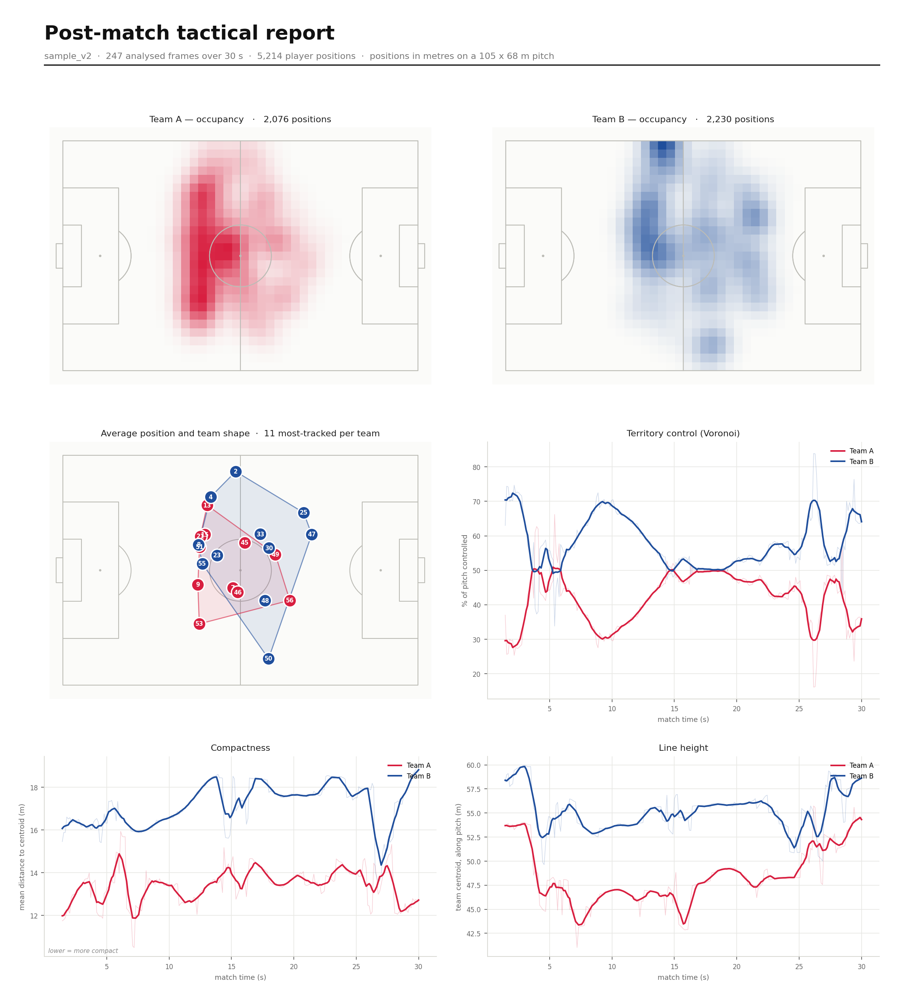

# FootballVision

[](https://github.com/heetdalsania/FootballVision/actions/workflows/ci.yml)
[](#requirements)
[](LICENSE)
[](#privacy-and-limitations)

Local-first football (soccer) video analysis for match recordings and live
macOS screen capture. FootballVision detects and tracks players, projects them
onto a top-down pitch, separates teams, measures tactical shape and pitch
control, builds a reviewable event timeline, and exports post-match analysis.

The default workflow uses free, open-source components. It requires no account,
API key, subscription, or cloud upload.



## Highlights

| Workflow | What FootballVision provides |
| --- | --- |
| Live analysis | macOS display/window capture, real-time pitch view, team shape, possession, match phase, and a floating always-on-top monitor |
| Video review | Upload or select local footage, pause/resume/stop jobs, scrub saved pitch states, and jump from events to nearby frames |
| Match intelligence | Conservative passes, turnovers, carries, restarts, and shot candidates with confirm/reject/rename review controls |
| Tactical analysis | Heatmaps, formations, compactness, line height, final-third presence, territory control, pass networks, and session comparison |
| Exports | Tracking, metrics, and reviewed-event CSV; dataset JSON; PNG and PDF reports; local annotated MP4 and event clips |
| Privacy | Match footage, model weights, the SQLite history, and generated artifacts remain on your machine |

> **Project status:** active public beta. The application and deterministic test
> suite are usable today, but computer-vision accuracy varies with footage. Treat
> inferred events and tactical measurements as analyst-assist output, not ground
> truth.

## Requirements

- macOS for live screen/window capture (video-file analysis works elsewhere)
- Python 3.11 or 3.12 recommended
- About 450 MB for the three football model files

## Quick start

```bash
python3.12 -m venv .venv
source .venv/bin/activate
python -m pip install --upgrade pip
python -m pip install -r requirements.txt
./scripts/download_weights.sh
```

The model script skips files already present in `weights/`. Recordings can be
uploaded directly from the source picker, or placed in `data/` or `uploads/`.
Uploads stay on this computer.

Start the server:

```bash
python main.py
```

Then open <http://localhost:8000> and choose a video, window, or display from
**Start Analysis**. A local video is the most reproducible first test.

For live capture, grant the terminal or app running FootballVision access in
**System Settings → Privacy & Security → Screen & System Audio Recording**, then
restart that app.

For a match playing in a browser, select the browser under **Windows**, not
**Entire screen**. FootballVision automatically opens an always-on-top floating
monitor in supported browsers, with a separate-window fallback and a native
macOS panel when the in-app browser blocks popups. Leave the match as the active
tab in its original window; that source window may be behind the monitor but
must not be minimized or moved to an
inactive macOS Space. Browser tabs are not independent macOS capture sources,
so switching the selected source window back to the FootballVision tab changes
what is being captured.

## Using FootballVision

Sessions and sampled pitch states are saved in local SQLite history. Video jobs
finish automatically at the end of the file and expose pause, resume, progress,
and stop controls. **Build exports** creates tracking, metrics, and reviewed
event CSV files, a dataset-ready JSON export, a visual PNG report, and a
printable two-page PDF whenever the session contains resolved team data.

On macOS, after setup you can also double-click `FootballVision.command`; it
starts the local server and opens the dashboard in your browser.

To check your installation or build a Finder-launchable app bundle:

```bash
./scripts/diagnose.py
./scripts/build_macos_app.sh
open dist/FootballVision.app
```

The app bundle is a lightweight launcher for this checkout and its `.venv`; it
does not embed Python, model weights, or match footage.

The **Match intelligence** card estimates possession, match phase, team
direction, and formation from repeated frames. Confirmed changes populate the
event timeline as passes, turnovers, carries, restarts, and conservative shot
candidates. Stop a session to scrub its saved pitch states, jump from an event
to the nearest state, or create a six-second local MP4 event clip. In history
you can confirm, reject, rename, and annotate inferred events; label tracked
players with names and shirt numbers; compare any two sessions; and inspect
possession samples, control, compactness, final-third presence, heatmaps,
formations, pass networks, and a local dominance timeline.

Use **Correct pitch** to replace an uncertain automatic calibration by clicking
the four visible pitch corners. The ball tracker smooths detections and bridges
short missed-detection gaps. **Overlay video** renders the saved pitch state,
team shape, possession, player labels, and accepted events over the source
footage. This local OpenCV export is intentionally silent; it does not preserve
the source audio track.

Useful options:

```bash
python main.py --port 8080
python main.py --host 0.0.0.0  # expose to your LAN only if you understand the risk
python main.py --reload  # development only
python main.py --demo    # legacy synthetic Coach demo
```

Team separation uses a fast local jersey-colour model by default. The larger
public SigLIP model is optional and still needs no login or token; cache it
before kickoff so it never interrupts analysis:

```bash
python scripts/download_team_model.py
FOOTBALLVISION_TEAM_BACKEND=siglip python main.py
```

## Verify

```bash
python -m pip install -r requirements-dev.txt
./scripts/quality_gate.sh
```

The test suite covers geometry, team assignment, tactical metrics, situation
retrieval, report rendering, analytics, event review, annotated-video export,
API source validation, and pipeline lifecycle failures. Benchmarks and their
measured outputs live in `benchmarks/`.

Run the real golden-video regression locally (about 15–30 seconds on a modern
machine):

```bash
python scripts/golden_video_benchmark.py
# or include it in the complete gate
RUN_GOLDEN=1 ./scripts/quality_gate.sh
```

For a broader local reliability check, place several short clips with different
lighting, camera motion, resolution, and occlusion in `data/reliability/`, then
run:

```bash
python scripts/video_reliability_suite.py
```

It reuses one loaded model set across every clip and writes a per-video JSON
result to `benchmarks/video_suite_latest.json`.

The benchmark fails if football recognition, calibration, people recall,
projection, team resolution/stability, or latency crosses the checked-in
thresholds. GitHub Actions runs the deterministic test gate on every push and
pull request; the media/model benchmark stays local because large videos and
weights are intentionally not committed.

## Repository map

| Area | Responsibility |
| --- | --- |
| `ui/api.py` | FastAPI pages, REST endpoints, and WebSockets |
| `src/tactical_pipeline.py` | Source lifecycle and real-time analysis loop |
| `src/fv_engine.py` | Detection, tracking, team classification, calibration |
| `src/ball_tracking.py` | Smoothed ball motion and short-gap recovery |
| `src/tactical_metrics.py` | Shape, compactness, pressing, and pitch control |
| `src/match_intelligence.py` | Temporal possession, events, phases, direction, and formations |
| `src/session_analytics.py` | Heatmaps, comparisons, pass networks, and aggregate session metrics |
| `src/state_embedding.py` | Similar-situation indexing and retrieval |
| `src/event_clip.py` | Local event-centered MP4 clip export |
| `src/annotated_video.py` | Local tactical-overlay MP4 export |
| `src/capture.py` | macOS display/window capture |
| `src/match_report.py` | Static post-match analyst report |
| `src/pdf_report.py` | Printable two-page post-match PDF |
| `src/session_report.py` | Report, CSV, and PDF generation from saved sessions |
| `db/session.py` | SQLite sessions, snapshots, events, labels, and artifact metadata |
| `tests/` | Deterministic geometry, lifecycle, analytics, export, and product regression tests |
| `benchmarks/` | Checked-in calibration, latency, detector, and golden-sample evidence |

`src/pipeline.py` and the `/coach` and `/fan` pages are the earlier NFL-oriented
prototype. The root route intentionally opens the football tactical product.

## Privacy and limitations

- Processing stays local; videos are not uploaded to an external service.
- `weights/`, videos, clips, captures, the SQLite database, and API keys are
  intentionally ignored by Git.
- Browser DRM may produce a black capture even when the match is visible. The
  application does not and should not attempt to bypass protected playback.
- For live window capture, the selected match window must not be minimized or
  moved to an inactive macOS Space.
- Detection quality still depends on camera angle, resolution, occlusion, and
  the supplied model weights. Passing software tests does not guarantee perfect
  perception on every broadcast.
- Annotated MP4 export is intentionally silent and does not preserve source
  audio.

## Contributing

Bug reports and focused pull requests are welcome. Read
[CONTRIBUTING.md](CONTRIBUTING.md) for the development workflow and
[SECURITY.md](SECURITY.md) for private vulnerability reporting. Please include
reproducible footage characteristics without uploading copyrighted match video.

## License and attribution

See [LICENSE](LICENSE) and [NOTICE](NOTICE). The tactical engine adapts the
open-source [Roboflow Sports](https://github.com/roboflow/sports) soccer example.
