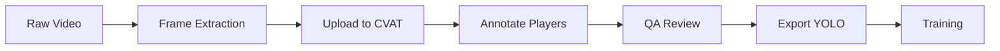

# CVAT Annotation Pipeline for NFL Vision

This document describes the annotation workflow using CVAT for labeling NFL video data.

## Setup

### CVAT Installation

```bash
# Option 1: Docker (Recommended)
git clone https://github.com/opencv/cvat
cd cvat
docker-compose up -d

# Access at http://localhost:8080
```

### Project Setup in CVAT

1. Create new project: **NFL Vision - Player Detection**
2. Add labels:
   - `player` (Rectangle) - Football players
   - `referee` (Rectangle) - Game officials  
   - `ball` (Rectangle) - Football
   - `coach` (Rectangle) - Sideline coaches

3. Configure attributes:
   - `team`: home | away | unknown
   - `jersey_number`: text (optional)
   - `position`: QB | RB | WR | TE | OL | DL | LB | DB | K | P

## Annotation Guidelines

### Player Bounding Boxes

| Rule | Description |
|------|-------------|
| **Tight boxes** | Box should tightly enclose the player |
| **Include helmet** | Always include helmet in the box |
| **Occluded players** | Mark if >50% visible |
| **Skip tiny players** | Skip if < 30px in any dimension |

### Quality Standards

- **Minimum IoU**: 0.7 with ground truth
- **Minimum frames**: Annotate every 5th frame, interpolate between
- **Review**: All annotations peer-reviewed before export

## Workflow



### 1. Frame Extraction

```bash
# Extract frames from video
python tools/extract_frames.py \
    --input video.mp4 \
    --output data/raw/frames \
    --fps 5
```

### 2. Upload to CVAT

1. Create task in project
2. Upload extracted frames
3. Assign to annotator

### 3. Annotation

Keyboard shortcuts:
- `N` - Create new box
- `F` - Propagate to next frame
- `V` - Toggle interpolation
- `1-4` - Quick label selection

### 4. Export

Export format: **YOLO 1.1**

```
data/annotations/
├── images/
│   ├── frame_00001.jpg
│   └── ...
├── labels/
│   ├── frame_00001.txt
│   └── ...
└── data.yaml
```

## Formation Labeling

For classification training, label formations at the clip level.

### Formation Labels

| Code | Formation | Description |
|------|-----------|-------------|
| SHOT | Shotgun | QB 5+ yards back |
| SHOT_SPR | Shotgun Spread | 4+ WRs |
| SHOT_TRP | Shotgun Trips | 3 WRs one side |
| I_FORM | I-Formation | FB/RB stacked |
| PRO | Pro Set | 2 backs side by side |
| SNGL | Single Back | 1 RB, no FB |
| PIST | Pistol | QB 3-4 yards back |
| D43 | 4-3 Defense | 4 DL, 3 LB |
| D34 | 3-4 Defense | 3 DL, 4 LB |
| NICK | Nickel | 5 DBs |
| DIME | Dime | 6 DBs |

### Clip Annotation Format

```json
{
  "clip_id": "game1_play42",
  "start_frame": 150,
  "end_frame": 210,
  "formation_offense": "SHOT_SPR",
  "formation_defense": "NICK",
  "play_type": "pass",
  "notes": "4 wide, DB blitz"
}
```

## Quality Assurance

### Automated Checks

```bash
# Run annotation validation
python tools/validate_annotations.py \
    --annotations data/annotations \
    --report qa_report.html
```

Checks performed:
- Box dimension constraints
- Label consistency
- Interpolation gaps
- Duplicate annotations

### Manual Review

1. Random sample 10% of frames
2. Calculate annotator agreement (Cohen's κ)
3. Target: κ > 0.85

## Export Scripts

### To YOLO Format

```bash
python tools/cvat_to_yolo.py \
    --cvat-export annotations.zip \
    --output data/processed/detection
```

### To Classification Format

```bash
python tools/cvat_to_classification.py \
    --cvat-export annotations.zip \
    --output data/processed/classification \
    --sequence-length 30
```

## Tips

> 💡 **Use interpolation**: Annotate key frames and let CVAT interpolate

> ⚠️ **Watch for occlusion**: Partially occluded players should still be annotated

> ✅ **Consistent labeling**: When in doubt, follow the "tight box" rule

## Resources

- [CVAT Documentation](https://opencv.github.io/cvat/docs/)
- [YOLO Annotation Format](https://docs.ultralytics.com/datasets/detect/)
- [NFL Big Data Bowl](https://www.kaggle.com/c/nfl-big-data-bowl-2024)
